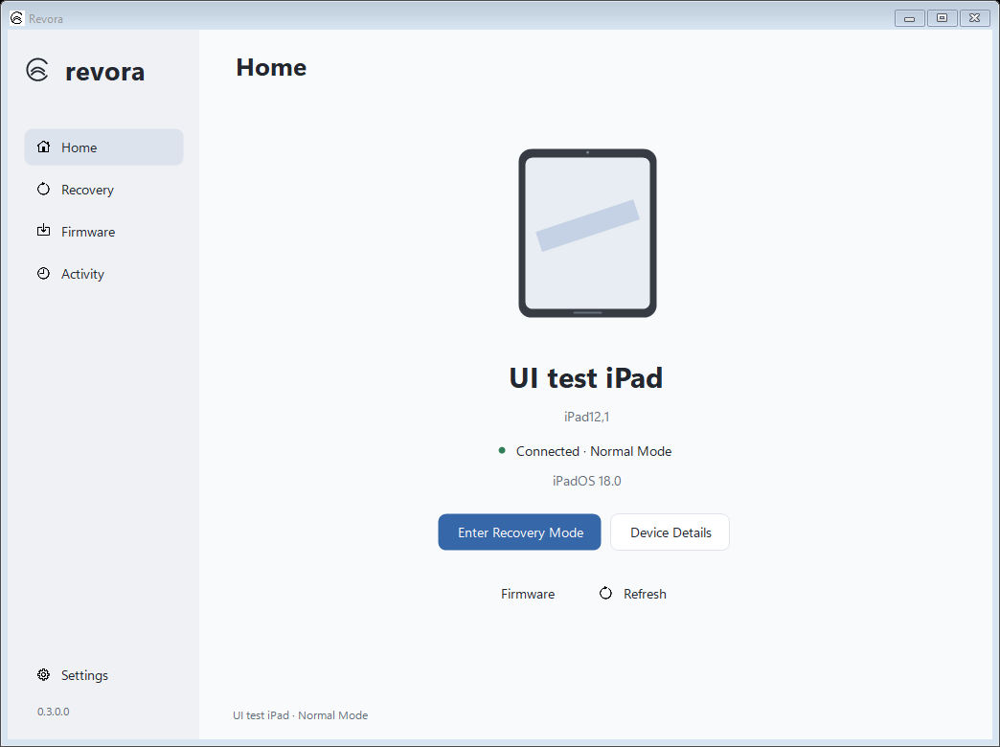
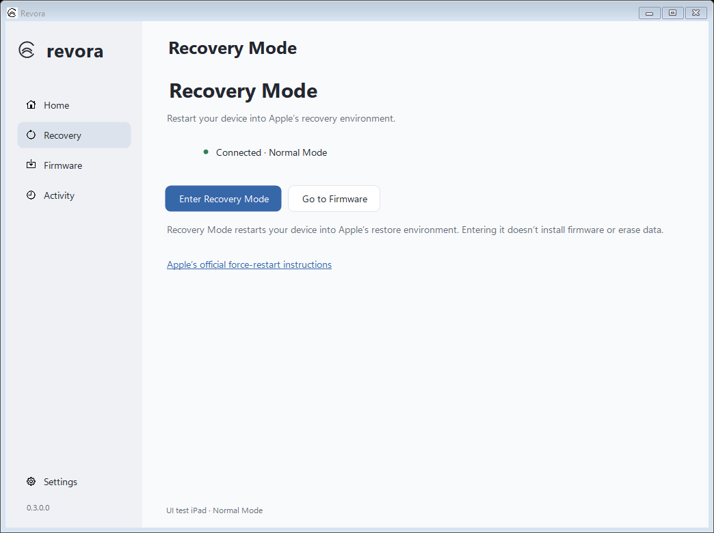
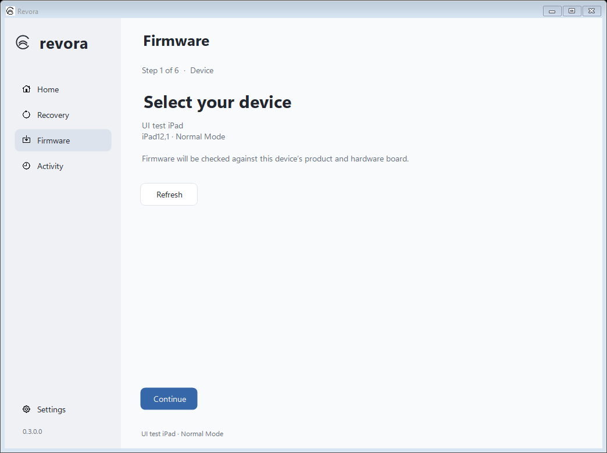
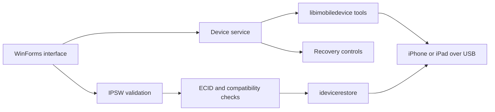

<div align="center">
  

  # Revora

  **A Windows recovery-mode and IPSW firmware utility for iPhone and iPad.**

  [](https://github.com/pxnami/Revora/releases)
  [](https://github.com/pxnami/Revora/actions/workflows/windows.yml)
  [](https://github.com/pxnami/Revora/issues)

  <sub>Open source, local-first, and built for Windows 10/11 x64.</sub>
</div>

<br>



> [!WARNING]
> Revora is an early development release. Recovery and firmware operations have automated coverage, but real-device restore has not yet been validated. Back up your device before installing firmware.

## What it does

Revora provides a focused Windows interface for inspecting an iPhone or iPad, entering or leaving recovery mode, and installing a compatible local IPSW. Device communication is handled by pinned builds from the libimobiledevice ecosystem.

| Device | Recovery | Firmware |
| --- | --- | --- |
| Automatic USB detection | Enter recovery mode | Inspect local IPSW manifests |
| Device and firmware details | Request a return to normal mode | Check product and hardware compatibility |
| Normal, recovery, and DFU recognition | Manual DFU exit guidance | Update or erase restore workflows |
| Local activity history | Mode-aware device status | Native progress and operation logs |

## Interface

<table>
  <tr>
    <td width="50%"></td>
    <td width="50%"></td>
  </tr>
  <tr>
    <td align="center"><sub>Recovery controls and current device mode.</sub></td>
    <td align="center"><sub>Device-targeted firmware compatibility flow.</sub></td>
  </tr>
</table>

<sub>Screenshots are generated by the UI test suite with synthetic device data.</sub>

## Restore safeguards

Revora treats firmware installation as a device-specific operation. Before execution it:

1. Reads the selected IPSW manifest.
2. Validates product type, hardware board, and install variant.
3. Targets the connected device by ECID.
4. Rechecks device identity immediately before restore.
5. Separates update and erase modes.
6. Requires explicit confirmation before an erase restore.

An update attempts to preserve user data but cannot guarantee it. An erase restore deletes all data. Revora cannot repair hardware, bypass Activation Lock, remove an Apple Account association, or install firmware Apple no longer signs.

## How it works



Device monitoring uses a single serialized polling loop. Unchanged scans do not rerender the interface, operations pause background monitoring while they own the USB tools, and matching device identity can be retained across mode changes.

## Install

Requirements:

- Windows 10 or 11 x64
- .NET Framework 4.8
- Apple USB drivers from [Apple Devices for Windows](https://support.apple.com/guide/devices-windows/welcome/windows)

Download the latest prerelease from [GitHub Releases](https://github.com/pxnami/Revora/releases), extract the complete archive, and run `Revora.exe`. Keep the included `tools` folder next to the executable.

For a normal-mode device, unlock it and accept **Trust This Computer**. Connect one recovery or DFU device at a time.

## Build and test

The desktop app uses the C# compiler included with Windows .NET Framework and has no NuGet dependencies. The first build downloads checksum-pinned Icons8 symbols into the ignored `bin/icons` cache and embeds them in the executable.

```powershell
git clone https://github.com/pxnami/Revora.git
cd Revora
./scripts/build.ps1 -Test
```

The build creates `dist/Revora/Revora.exe`. Automated checks cover parsing, firmware compatibility, restore targeting, argument safety, process behavior, monitoring transitions, destructive confirmation, and rendered WinForms layouts from 100% to 200% simulated scaling. These checks use synthetic fixtures and do not operate on a connected device.

To run the separate read-only USB and interface check after building a native bundle:

```powershell
./bin/tests/Revora.UiSmoke.exe ./bin/tests ./dist/Revora/tools
```

This check scans connected devices and captures local screenshots. It does not change device mode or install firmware. Follow the [device validation checklist](docs/DEVICE-VALIDATION.md) before recommending a release for real-device use.

### Native toolchain

The complete distributable also requires MSYS2. From an **MINGW64** shell:

```bash
pacman -Syu
pacman -S --needed base-devel git mingw-w64-x86_64-gcc mingw-w64-x86_64-autotools mingw-w64-x86_64-pkgconf mingw-w64-x86_64-openssl mingw-w64-x86_64-curl-winssl mingw-w64-x86_64-libzip mingw-w64-x86_64-readline
bash scripts/build-native.sh
```

Then package the app from PowerShell:

```powershell
./scripts/build.ps1 -Test -NativeTools dist/Revora/tools -Package
Compress-Archive -Path dist/native-sources/* -DestinationPath dist/Revora-native-sources.zip
```

Native revisions are pinned in `native/revisions.txt`. GitHub Actions builds, tests, packages, verifies checksums, and publishes tagged builds as prereleases.

## Project structure

```text
.github/workflows/       Windows build, test, and prerelease workflow
assets/                  Revora logo, app icon, and icon manifest
docs/                    Screenshots and physical-device validation guide
native/                  Pinned native dependency revisions
scripts/                 Desktop and native build scripts
src/Revora/              WinForms application source
tests/                   Core, native, and rendered UI checks
```

## Data and privacy

Revora runs locally and does not provide accounts, analytics, or cloud synchronization. Logs and extracted firmware cache are stored in `%LOCALAPPDATA%\Revora`. Logs may contain device identifiers, so review them before sharing. Firmware signing checks performed by the restore engine communicate with Apple.

## Limitations

- Physical recovery, restore, and real monitor-DPI transitions still require device testing.
- Exit recovery requests a reboot; an unresolved boot problem can return the device to recovery.
- The current app and bundled tools are unsigned and may be blocked by Windows application-control policies.
- Compatibility checks cannot override Apple's active firmware-signing rules.

## License and attribution

Revora's C# source is available under the [MIT License](LICENSE). Interface icons are from [Icons8 Apple SF Symbols](https://icons8.com/icons/family-sf-symbols). Bundled native tools and dependencies retain their upstream licenses; see [THIRD-PARTY.md](THIRD-PARTY.md).
